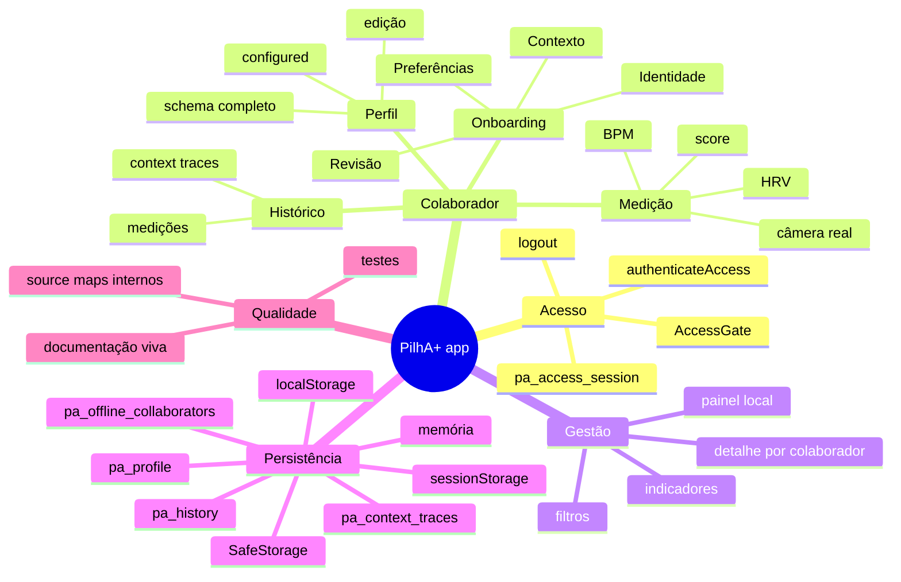
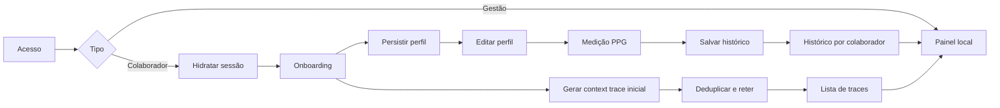
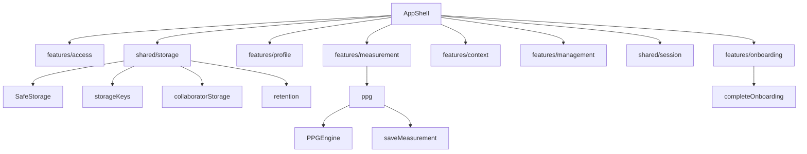

# Blueprint Visuals

## Mapa mental

```mermaid
mindmap
  root((PilhA+ app))
    Acesso
      AccessGate
      authenticateAccess
      pa_access_session
      logout
    Colaborador
      Onboarding
        Identidade
        Contexto
        Preferências
        Revisão
      Perfil
        schema completo
        edição
        configured
      Medição
        câmera real
        BPM
        HRV
        score
      Histórico
        medições
        context traces
    Gestão
      painel local
      filtros
      detalhe por colaborador
      indicadores
    Persistência
      SafeStorage
      localStorage
      sessionStorage
      memória
      pa_profile
      pa_history
      pa_context_traces
      pa_offline_collaborators
    Qualidade
      testes
      source maps internos
      documentação viva
```

## Fluxo operacional

```mermaid
flowchart LR
  A[Acesso] --> B{Tipo}
  B -->|Colaborador| C[Hidratar sessão]
  B -->|Gestão| D[Painel local]
  C --> E[Onboarding]
  E --> F[Persistir perfil]
  F --> G[Editar perfil]
  G --> H[Medição PPG]
  H --> I[Salvar histórico]
  E --> J[Gerar context trace inicial]
  J --> K[Deduplicar e reter]
  I --> L[Histórico por colaborador]
  K --> M[Lista de traces]
  L --> D
  M --> D
```

## Arquitetura modular

```mermaid
flowchart TD
  App[AppShell] --> Access[features/access]
  App --> Onboarding[features/onboarding]
  App --> Profile[features/profile]
  App --> Measurement[features/measurement]
  App --> Context[features/context]
  App --> Management[features/management]
  App --> Session[shared/session]
  App --> Storage[shared/storage]
  Storage --> Safe[SafeStorage]
  Storage --> Keys[storageKeys]
  Storage --> Collab[collaboratorStorage]
  Storage --> Retention[retention]
  Measurement --> PPG[ppg]
  PPG --> Engine[PPGEngine]
  PPG --> Save[saveMeasurement]
  Onboarding --> Complete[completeOnboarding]
```
